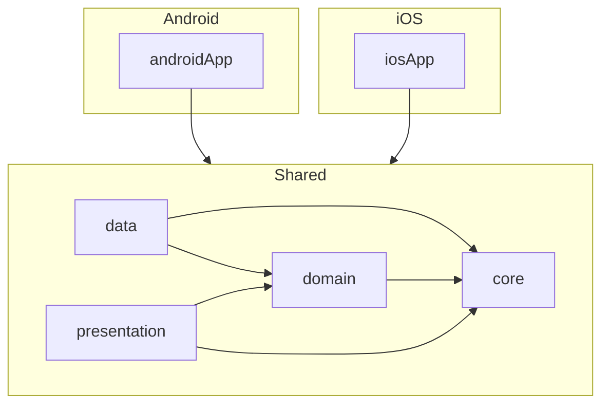
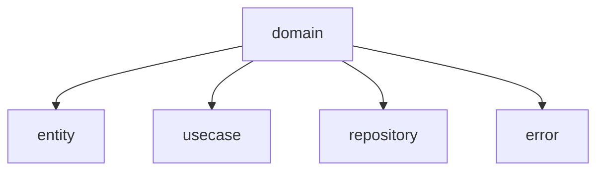
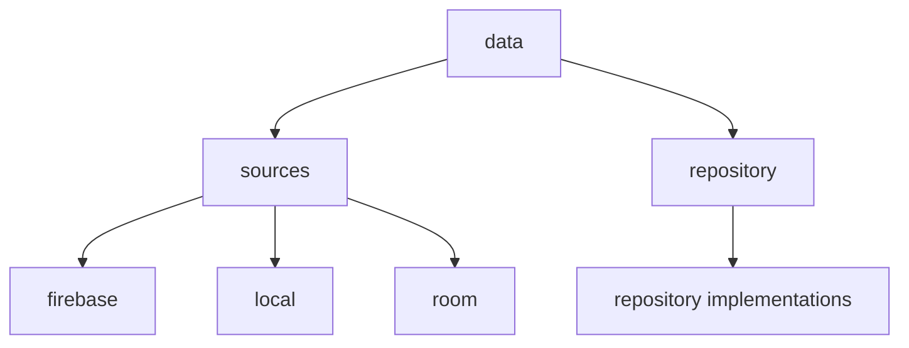
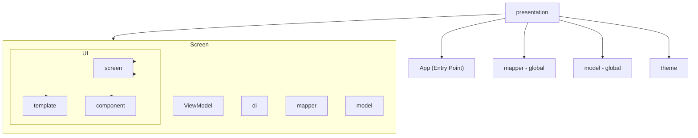

# Clean architecture

KMPShip is structured into three main modules:

* **`androidApp`**: the Android-specific entry point
* **`iosApp`**: the iOS-specific entry point
* **`shared`**: the cross-platform module that holds the core application logic

Inside the `shared` module, the codebase follows Clean Architecture principles with four dedicated modules:

* [**`domain`**](#domain-module): contains business rules and use cases
* [**`data`**](#data-module): handles API communication, storage, and data sources
* [**`presentation`**](#presentation-module): manages UI logic and state
* [**`core`**](#core-module): includes everything shared across the other layers (ie. analytics)

This architecture ensures a clean separation of concerns, encourages reusability, and makes the codebase easier to test, maintain, and evolve over time.

&nbsp;



---

## `Domain` module

The `domain` module is located at:

```
shared/domain/src/commonMain/kotlin/{your/package/name}/domain
```

It defines the core business logic of your app — the heart of the product — and is completely platform-independent. The code here contains no framework-specific logic.

This module includes the following directories:

* **`entity`**: contains all domain entities, representing the core models of your business logic.
* **`usecase`**: defines the use cases that encapsulate the main features and behaviors of your app.
* **`repository`**: declares interfaces that must be implemented in the data layer to access or persist data.
* **`error`**: holds all error and exception definitions that can be thrown or handled in the domain layer.

This clear separation ensures your business rules remain stable, testable, and decoupled from platform or infrastructure concerns.



---

## `Data` module

The `data` module is located at:

```
shared/data/src/commonMain/kotlin/{your/package/name}/data
```

It contains the logic for fetching, storing, and managing data.

* The `sources` directory includes three predefined data sources:

    * `firebase`: contains configuration for using [Firebase Firestore](https://firebase.google.com/docs/firestore) and [Firebase Remote Config](https://firebase.google.com/docs/remote-config)
    * `local`: used for storing key-value pairs using the [Multiplatform Settings](https://github.com/russhwolf/multiplatform-settings) library
    * `room`: handles structured local storage using SQL tables with [Room](https://developer.android.com/kotlin/multiplatform/room). This source is ready to be configured with your own entities and DAOs, and is ideal for offline persistence or complex local queries.

  If you need to add a new data source, simply create a new folder inside the `sources` directory.

* The `repository` directory contains the concrete implementations of the repositories defined in the [**`domain`**](#domain-module) module.

&nbsp;



---

## `Presentation` module

The `presentation` module is located at:

```
shared/presentation/src/commonMain/kotlin/{your/package/name}/presentation
```

It contains the **shared UI logic** for Android and iOS, fully built with **Compose Multiplatform**, and structured to promote clarity, reusability, and separation of concerns.

* The **`App` class**: This is the entry point of the shared UI. It initializes the app structure and hosts the navigation system.

* The **`screen`**: Contains all the screens of the app. Each screen follows a consistent structure:
    * `*ViewModel`: The screen's ViewModel class which handles state and logic.
    * `di`: defines screen-specific dependency injection bindings.
    * `mapper`: maps domain entities to screen-specific models.
    * `model`: holds UI models specific to the screen.
    * `ui`:
        * `screen`: the Composable entry point that wires the ViewModel to the UI.
        * `template`: defines the layout structure or skeleton of the screen.
        * `component`: contains UI components unique to this screen.

* **`mapper`**: Houses global mappers that convert domain entities to presentation models shared across multiple screens.

* **`model`**: Contains reusable UI models used across multiple screens.

* **`theme`**: Defines the app's theme configuration, including:
    * Color palette
    * Typography (fonts)
    * Shape definitions

This architecture ensures that UI code stays **modular, testable, and platform-agnostic**, making it easy to build and maintain rich user interfaces across both Android and iOS.

&nbsp;



